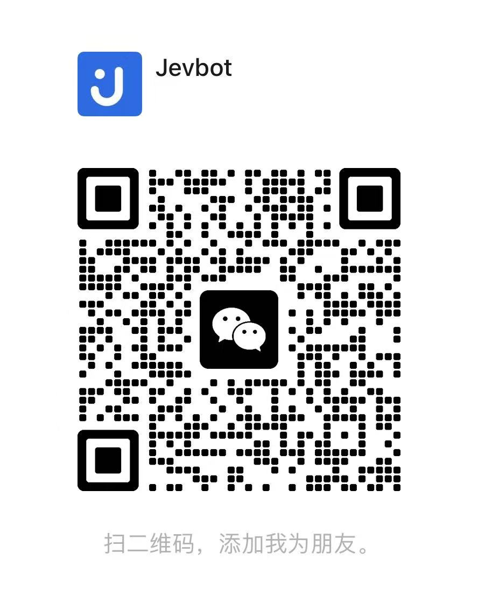
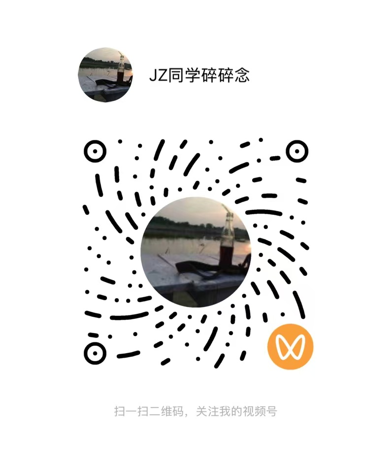
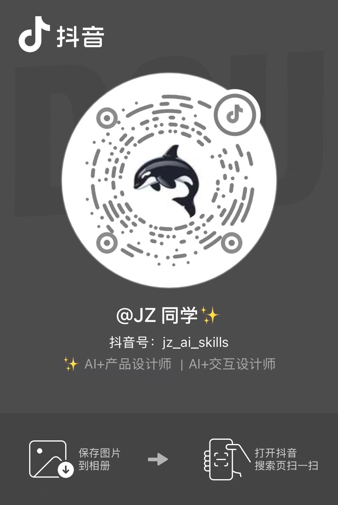
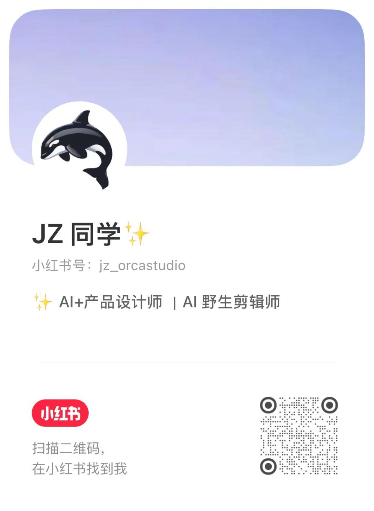

# Jevbot

挂在你正在用的 App 旁边的判断层：读懂屏幕上正在发生什么，用 [TypeSafe Jev](https://typesafe.ai/) 判断模型给出带把握度的结论，再把结论变成可以一键执行的动作。

第一个跑通的场景是聊天副驾——对方发来一句话，面板立刻告诉你**这句话真正想要什么、风险几级、该怎么回**，并给出 3 条候选回复。点「填入」进输入框，**发送永远你自己按**。

## 下载

**所有应用合在一起的版本**：[Releases](https://github.com/jevbot-dev/jevbot-mac-releases/releases/latest)

只要某一个应用的支持，下对应的单独版本：

| 应用 | 单独下载 | 状态 |
|---|---|---|
| 飞书 | [jevbot-feishu-mac-releases](https://github.com/jevbot-dev/jevbot-feishu-mac-releases/releases/latest) | 已适配 |
| QQ | [jevbot-qq-mac-releases](https://github.com/jevbot-dev/jevbot-qq-mac-releases/releases/latest) | 已适配 |
| 微信 | [jevbot-wechat-mac-releases](https://github.com/jevbot-dev/jevbot-wechat-mac-releases/releases/latest) | 已适配 |
| 企业微信 | [jevbot-wework-mac-releases](https://github.com/jevbot-dev/jevbot-wework-mac-releases/releases/latest) | 已适配 |
| Telegram | [jevbot-telegram-mac-releases](https://github.com/jevbot-dev/jevbot-telegram-mac-releases/releases/latest) | 已适配 |
| 剪映 | — | 未适配 |

系统要求 macOS 14 及以上。安装包已用 Developer ID 签名并经 Apple 公证。

## 能做什么

| | |
|---|---|
| 读到聊天内容 | 微信、企业微信、飞书、QQ；聊天窗口不在前台也读得到 |
| 判断 | 真实意图 · 风险 0–9 · 对方需要什么 · 建议动作 · 有没有潜台词 |
| 候选回复 | 生成 3 条，由 Jev 按合适度排序 |
| 填入 | 一键进输入框，多数情况下不会抢走你的焦点 |
| 面板 | 贴着聊天窗口右侧；拖动窗口时先隐去，停稳再回来 |

判断约 1 秒，一次一分钱都用不到。

**不做的事**：不自动发送、不碰转账红包收款、不注入不 hook 不改目标 App、不读它们的数据库。只读你自己设备上你自己有权看的窗口。

## 安装

1. 下载 DMG，打开后把 Jevbot 拖进「应用程序」
2. **系统设置 › 隐私与安全性 › 辅助功能** 勾上 Jevbot，再退出重开一次（macOS 不会给已在运行的程序补发权限）
3. 菜单栏 Jevbot → 设置 → 接口，填 TypeSafe（判断）和 DeepSeek（回复）的密钥，点「测试连接」
4. 用微信的话还要勾上**屏幕录制**

打开任意会话，面板会自己浮出来。

每个版本附带 `SHA256SUMS.txt`，下载后可以校验：

```bash
shasum -a 256 -c SHA256SUMS.txt
```

## 隐私

送到云端的只有最近 10 条消息和你写的关系描述。不传联系人、不传历史。

密钥只进登录钥匙串或环境变量，不落配置文件、不进日志。

设置里的会话白名单可以把它限制在指定的几个会话里。

## 微信

<table>
  <tr>
    <td align="center" width="50%">
      <br>
      <b>加微信</b><br>
      <sub>Jevbot · 长期有效</sub>
    </td>
    <td align="center" width="50%">
      <br>
      <b>进群</b><br>
      <sub>Jevbot-大姐夫 · 7 天一换</sub>
    </td>
  </tr>
</table>

> 群二维码 7 天失效（当前这张 2026-09-29 前有效），过期了在这里换新的。
> 微信号长期有效，加不上群可以直接加。

## 联系

| | |
|---|---|
| X（产品） | [@jevbot_dev](https://x.com/jevbot_dev) |
| X（个人） | [@zhenwusw](https://x.com/zhenwusw) |
| Issues | [提 bug、报某个应用读不到、提适配需求](https://github.com/jevbot-dev/jevbot-mac-releases/issues) |

<table>
  <tr>
    <td align="center" width="33%">
      <br>
      <b>视频号</b><br>
      JZ同学碎碎念<br>
      <sub>扫码关注</sub>
    </td>
    <td align="center" width="33%">
      <br>
      <b>抖音</b><br>
      JZ 同学<br>
      <sub>抖音号 jz_ai_skills</sub>
    </td>
    <td align="center" width="33%">
      <br>
      <b>小红书</b><br>
      JZ 同学<br>
      <sub>小红书号 jz_orcastudio</sub>
    </td>
  </tr>
</table>
